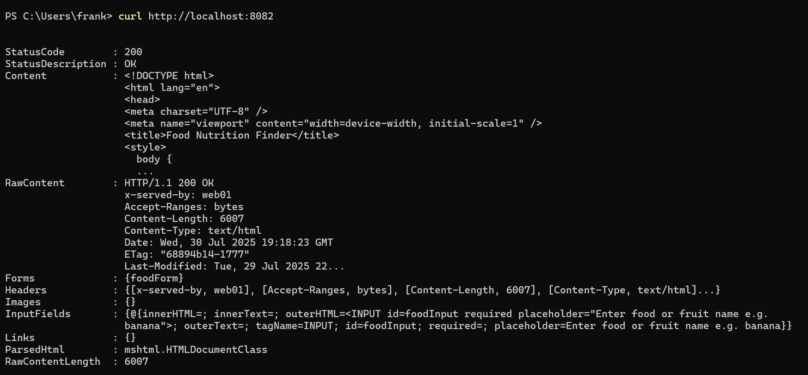

# Nutrient Finder App

The **Nutrient Finder** is a lightweight web application that allows users to search for the nutritional benefits of various foods and fruits. It uses the [Food Nutrition Information API](https://rapidapi.com/edamam/api/food-database) to fetch data and is designed to be fast, simple, and educational.

---

## Features

- Search any food or fruit
- View nutritional components like fats, carbohydrates, fiber, sugar, and more
- Auto-summary: "If you eat 1 [food], you get [nutrients] in your body."
- Deployed on Docker containers with HAProxy load balancing

---

## Technologies Used

- HTML, CSS, JavaScript (Vanilla)
- Docker
- HAProxy
- RapidAPI (food-nutrition-information API)

---

## Local Setup

1. **Clone this repo**
   ```bash
   git clone https://github.com/yourusername/nutrient-finder.git
   cd nutrient-finder
Build Docker Image

bash
Copy
Edit
docker build -t yourusername/nutrient-finder:v1 .
Run the Container Locally

bash
Copy
Edit
docker run -p 8080:8080 yourusername/nutrient-finder:v1
Test It
Open http://localhost:8080

🚢 Docker Hub
To push the image:

bash
Copy
Edit
# Login using a personal access token
echo "your_token" | docker login --username yourusername --password-stdin

# Tag and push
docker tag nutrient-finder yourusername/nutrient-finder:v1
docker push yourusername/nutrient-finder:v1
View it at: https://hub.docker.com/repository/docker/yourusername/nutrient-finder

Deployment in Lab Environment
Web Servers (web-01, web-02)
bash
Copy
Edit
# On each web server
docker pull yourusername/nutrient-finder:v1

docker run -d --name app --restart unless-stopped \
  -p 8080:8080 yourusername/nutrient-finder:v1
Each server listens internally at:

http://web-01:8080

http://web-02:8080

HAProxy Load Balancer (lb-01)
HAProxy Configuration (/etc/haproxy/haproxy.cfg):

haproxy
Copy
Edit
frontend http-in
    bind *:8083
    default_backend webapps

backend webapps
    balance roundrobin
    server web01 172.20.0.11:8080 check
    server web02 172.20.0.12:8080 check
    http-response set-header X-Served-By %[srv_name]
Reload HAProxy:

bash
Copy
Edit
docker exec -it lb-01 sh -c 'haproxy -sf $(pidof haproxy) -f /etc/haproxy/haproxy.cfg'
Test Load Balancing
From your host:

bash
Copy
Edit
curl http://localhost:8083
Repeat the command multiple times and confirm the X-Served-By response header alternates between web01 and web02.


